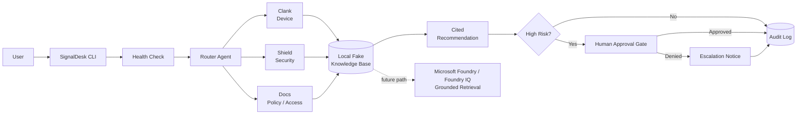

# SignalDesk Agent Console Architecture

## System Overview

SignalDesk Agent Console processes IT support tickets through a routed multi-agent workflow. The user selects a ticket from the CLI, the system runs a health check, then a router classifies the issue and assigns it to a specialist agent: Clank for device issues, Shield for security, or Docs for policy and access.

Each agent queries a local fake knowledge base and returns a cited recommendation. High-risk tickets are held at an approval gate requiring human confirmation before proceeding. All decisions are written to a local audit log.

The dotted path shows the Microsoft Foundry / Foundry IQ integration target. In the current demo, SignalDesk uses a local fictional knowledge base for safe testing. A Foundry-connected version would replace or extend that local knowledge base with a grounded retrieval layer.

## Architecture Diagram

## System Flow

1. User selects a fake IT support ticket.
2. SignalDesk runs a health check.
3. The router reads the ticket category.
4. The router assigns the issue to a specialist agent.
5. The assigned agent searches the local fake knowledge base.
6. SignalDesk returns recommended steps with a cited fictional source.
7. High-risk tickets trigger a human approval gate.
8. SignalDesk writes a local audit log.

## Agent Roles

| Agent  | Purpose                                                                                     |
| ------ | ------------------------------------------------------------------------------------------- |
| Clank  | Handles device troubleshooting, VPN issues, laptop storage, and technical support tasks.    |
| Shield | Handles suspicious emails, security reports, risky actions, and escalation-aware workflows. |
| Docs   | Handles access, policy, Microsoft 365 sign-in, and knowledge base questions.                |

## Core Components

| Component              | File                       | Purpose                                                                     |
| ---------------------- | -------------------------- | --------------------------------------------------------------------------- |
| Ticket data            | `data/tickets.json`        | Stores fake IT support tickets for the demo.                                |
| Knowledge base         | `data/knowledge_base.json` | Stores fictional support guidance and cited sources.                        |
| Agent router           | `app.py`                   | Maps ticket categories to specialist agents.                                |
| Health check           | `app.py`                   | Confirms tickets, knowledge base, and logs folder are available.            |
| Approval gate          | `app.py`                   | Requires approval before proceeding with high-risk actions.                 |
| Audit logging          | `app.py`                   | Writes local JSON logs for each processed ticket.                           |
| Log folder placeholder | `logs/.gitkeep`            | Keeps the logs folder in the public repo without committing generated logs. |

## Safety Design

SignalDesk does not use real customer data, real company data, private logs, credentials, secrets, or proprietary files.

All demo tickets, policies, and knowledge base sources are fictional.

High-risk tickets do not proceed silently. They require human approval before the action continues. If approval is denied, the action is blocked and the ticket is escalated.

## Microsoft Foundry / Foundry IQ Fit

SignalDesk is designed to fit Microsoft Foundry and Foundry IQ patterns:

* Grounded answers from a controlled knowledge source
* Routing between task-specific agents
* Cited support guidance
* Reviewable reasoning flow
* Human-in-the-loop control for risky actions
* Reliability checks before task handling

This first version uses a local fake knowledge base so the project remains safe, simple, and demo-ready. A future Foundry-connected version could replace or extend the local knowledge base with a grounded retrieval layer.
